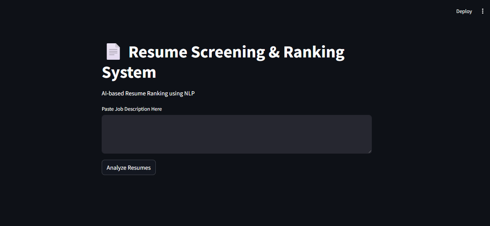
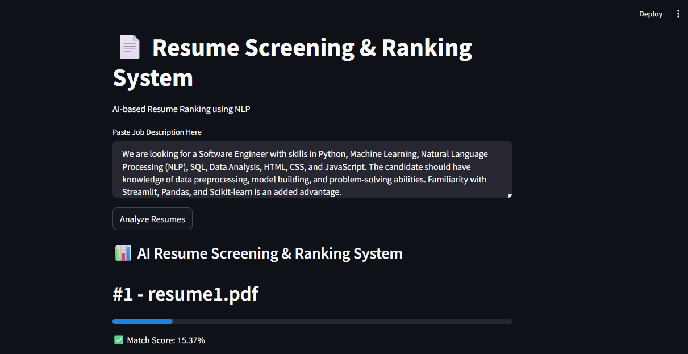
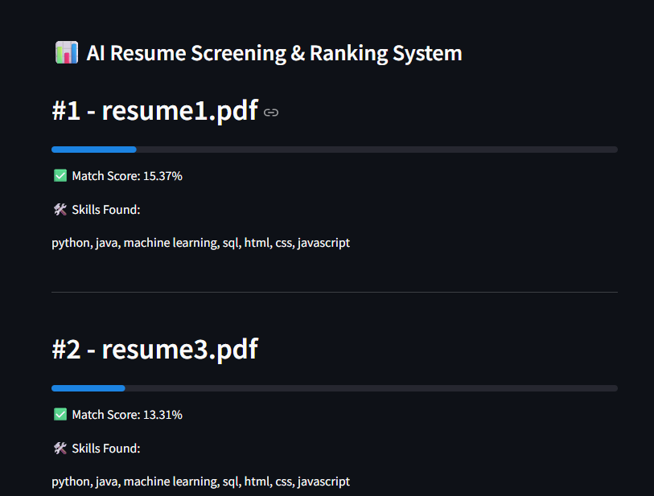

# 🤖 AI Resume Screening & Ranking System

## Live Demo

https://deeksha35-resume-screening-system-app-38amyb.streamlit.app/

---
## 📌 Project Overview
The AI Resume Screening & Ranking System is an NLP-based application that helps automate the resume shortlisting process. The system compares resumes with a given job description and ranks candidates based on similarity scores.

This project reduces manual effort in recruitment and improves the efficiency of resume screening.

---
## Screenshots

### Home Page

### Job Description Input

### Resume Ranking Results

# 🚀 Features
- Upload and analyze PDF resumes
- Job description matching
- Resume ranking based on similarity score
- Skill extraction from resumes
- NLP-based text processing
- User-friendly Streamlit interface

---

# 🛠️ Technologies Used

## Programming Language
- Python

## Libraries & Frameworks
- Streamlit
- Scikit-learn
- Pandas
- PyPDF2
- NLTK

## NLP Techniques
- TF-IDF Vectorization
- Cosine Similarity

---

# 📂 Project Structure

resume_screening_project/

│

├── app.py

├── requirements.txt

├── README.md

│

├── resumes/

│ ├── resume1.pdf

│ ├── resume2.pdf

│ ├── resume3.pdf

---

# ⚙️ Installation & Setup

## Step 1: Clone or Download the Project

git clone <repository_link>

OR download the project folder manually.

---

## Step 2: Install Required Libraries

Open terminal inside project folder and run:

pip install streamlit scikit-learn pandas nltk PyPDF2

---

## Step 3: Add Resume PDFs

Place all resume PDF files inside the resumes folder.

Example:

resumes/

resume1.pdf

resume2.pdf

resume3.pdf

---

## Step 4: Run the Application

streamlit run app.py

The application will open automatically in the browser.

---

# 📊 Working of the System

1. User enters a job description.
2. System reads all resumes from the resumes folder.
3. Text is extracted from PDF resumes.
4. TF-IDF converts text into numerical vectors.
5. Cosine similarity calculates similarity scores.
6. Resumes are ranked based on matching percentage.
7. Matching skills are displayed.

---

# 🧠 NLP Techniques Used

## TF-IDF Vectorization
TF-IDF identifies important words in resumes and job descriptions while reducing the importance of common words.

## Cosine Similarity
Cosine similarity measures how similar two text documents are.

---

# 📈 Output
The system displays:
- Resume ranking
- Match percentage
- Extracted skills

---

# 🎯 Advantages
- Saves recruiter time
- Automates resume screening
- Reduces manual errors
- Faster candidate shortlisting

---

# 🔮 Future Enhancements
- Resume upload feature
- AI chatbot integration
- Cloud deployment
- Advanced skill matching
- Deep learning-based ranking

---

# 👩‍💻 Author
Deeksha Shankar Naik

---

# 📌 Conclusion
The AI Resume Screening & Ranking System successfully automates the process of resume analysis using NLP techniques. The system improves hiring efficiency by ranking resumes according to job relevance and extracted skills.
